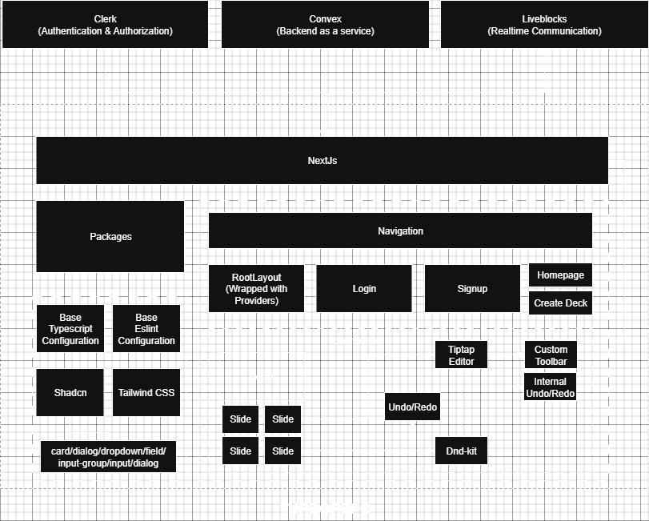

# 🧩 Slideck

> Collaborative slide deck editor — built with Next.js, Convex, Clerk, and Liveblocks.

---

## 🚀 Overview

**Slideck** is a modern, real-time collaborative slide deck editor designed for small teams, educators, and creators.  
Built on top of **Next.js App Router**, it uses **Convex** for backend data and live sync, **Clerk** for authentication, **liveblocks** for realtime collaboration and **Shadcn UI** for a sleek dark-mode interface and base ui framework.

---

## ✨ Features

- 🤠 **Authentication** — Clerk-powered login & signup
- ❐ **Deck & Slide Management** — Create decks and slides dynamically
- 🧩 **Live Collaboration** — Liveblocks for multi-user editing sessions
- 🔗 **Sharing** — Share decks or individual slides securely via email
- ⚡ **Convex Backend** — Real-time DB, mutations, queries, and actions
- 🧠 **Type Safety** — End-to-end typing with Convex + TypeScript

---

## 🏗️ Tech Stack

| Layer            | Tech                                                              |
| ---------------- | ----------------------------------------------------------------- |
| Frontend         | [Next.js 15](https://nextjs.org/), [React 19](https://react.dev/) |
| Backend          | [Convex](https://convex.dev/)                                     |
| Auth             | [Clerk](https://clerk.com/)                                       |
| Collaboration    | [Liveblocks](https://liveblocks.io/)                              |
| UI State         | [Tailwind CSS](https://tailwindcss.com/)                          |
| UI Library       | [Shadcn](https://ui.shadcn.com/)                                  |
| Rich Text Editor | [Tiptap](https://tiptap.dev/)                                     |



---

## 📁 Folder Structure

```
├── apps/
│ └── web/ # Next.js 14 App Router project
│ ├── app/
│ │ ├── dashboard/
│ │ │ ├── components/ # Reusable UI pieces (dialogs, cards, deck actions)
│ │ │ ├── decks/
│ │ │ │ ├── [deckId]/ # Deck view with slide listing
│ │ │ │ │ ├── page.tsx # Displays slides in a deck
│ │ │ │ │ └── slides/
│ │ │ │ │ └── [slideId]/page.tsx # Individual slide editor
│ │ │ └── page.tsx # Dashboard home
│ │ ├── components/
│ │ │ ├── providers.tsx # Combines Clerk + Convex + Liveblocks + Theme
│ │ │ ├── Navigation.tsx # Top navigation bar
│ │ │ └── SyncClerkUserToConvex.tsx # Syncs Clerk users to Convex
│ │ └── layout.tsx # Root layout (includes providers)
│ ├── public/ # Static assets
│ └── next.config.mjs
│
├── convex/ # Convex backend logic
│ ├── schema.ts # Database schema
│ ├── users.ts # User upsert + queries
│ ├── decks.ts # Deck CRUD + sharing logic
│ ├── slides.ts # Slide CRUD + sharing logic
│ └── _generated/ # Auto-generated Convex API + types
│
├── packages/
│ └── ui/ # Shadcn-based design system
│ ├── components/ # Reusable styled components
│ └── index.ts # Exports for easy imports across apps
│
├── .env.local # Environment configuration (Clerk, Convex, Liveblocks)
├── package.json
├── tsconfig.json
└── README.md             # Slide CRUD + sharing logic
```

---

## ⚙️ Environment Variables

Create a `.env.local` file in the root directory:

```bash
# Clerk
NEXT_PUBLIC_CLERK_PUBLISHABLE_KEY=pk_test_*****
CLERK_SECRET_KEY=sk_test_*****

NEXT_PUBLIC_CLERK_SIGN_IN_URL="/login"
NEXT_PUBLIC_CLERK_SIGN_UP_URL="/signup"
NEXT_PUBLIC_CLERK_AFTER_SIGN_IN_URL="/dashboard"

# Convex
NEXT_PUBLIC_CONVEX_URL=https://your-deployment.convex.cloud
CONVEX_DEPLOYMENT=dev:your-project-id

# Liveblocks
NEXT_PUBLIC_LIVEBLOCKS_PUBLIC_KEY=pk_dev_*****

# Clerk JWT Template
NEXT_PUBLIC_CLERK_JWT_ISSUER_DOMAIN=https://your-app.clerk.accounts.dev
```

---

## 🧠 Key Convex Functions

### 🗂️ `decks.ts`

- `shareDeck`: share a deck by email (uses internal `users` table)
- `getSharedDecks`: returns decks shared with the current user

### 📑 `slides.ts`

- `shareSlide`: share a specific slide by email
- `getSharedSlides`: fetch all slides shared with the user

---

## 🧭 Local Development

```bash
# 1. Install dependencies
pnpm install

# 2. Run Convex dev backend
npx convex dev

# 3. Run Next.js app
pnpm dev
```

Then open [http://localhost:3000](http://localhost:3000).

---

## 💡 Usage Flow

1. Sign up or log in via Clerk.
2. A Convex user record is automatically created (`SyncClerkUserToConvex`).
3. Create a new deck → add slides.
4. Use the “Share” button to share decks or individual slides by email.
5. Shared users will see these under their **“Shared with me”** view.

---

## 🧩 Sharing Logic

| Entity | Field                  | Description                          |
| ------ | ---------------------- | ------------------------------------ |
| Deck   | `sharedWith: string[]` | Clerk IDs of users with access       |
| Slide  | `sharedWith: string[]` | Clerk IDs of users with access       |
| User   | `clerkUserId`          | Primary key mapped to Clerk identity |

---

## 🧱 Providers Setup

All providers are combined in `components/providers.tsx`:

```tsx
<ClerkProvider>
  <ConvexProviderWithClerk client={convex} useAuth={useAuth}>
    <LiveblocksProvider publicApiKey={process.env.NEXT_PUBLIC_LIVEBLOCKS_PUBLIC_KEY!}>
      <NextThemesProvider defaultTheme="dark">{children}</NextThemesProvider>
    </LiveblocksProvider>
  </ConvexProviderWithClerk>
</ClerkProvider>
```

---

## 🧑‍🤝‍🧑 Contributors

- **Sanyam Singh** – Full-stack development, architecture, and design

---
